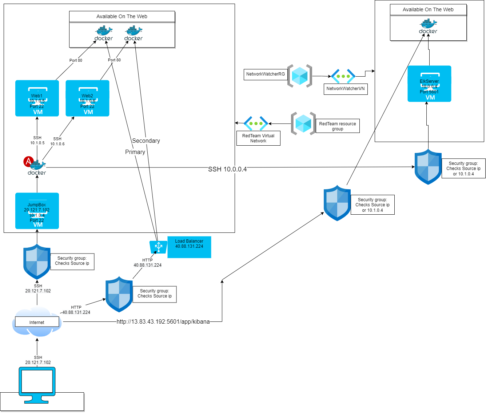

# Project1Cybersecurity
Ansible YALM scripts and network diagrams for a cloud security and Bash Scripts for linux administrating.

## Automated ELK Stack Deployment

The files in this repository were used to configure the network depicted below.

These files have been tested and used to generate a live ELK deployment on Azure. They can be used to either recreate the entire deployment pictured above. Alternatively, select portions of the _____ file may be used to install only certain pieces of it, such as Filebeat.

  - [Elk-Install](Ansible/install-elk.yml)
  - [Hosts](Ansible/hosts.txt)
  - [PenTest](Ansibles/pentest.yml)
  - [Filebeat-Playbook](Ansible/filebeat-playbook.yml)
  - [Filebeat-Config](Ansible/filebeat-config.yml)
  - [Metricbeat-Playbook](Ansible/metricbeat-playbook.yml)
  - [Metricbeat-Config](Ansible/metricbeat-config.yml)

This document contains the following details:
- Description of the Topology
- Access Policies
- ELK Configuration
  - Beats in Use
  - Machines Being Monitored
- How to Use the Ansible Build

### Description of the Topology

The main purpose of this network is to expose a load-balanced and monitored instance of DVWA, the Damn Vulnerable Web Application.

Load balancing ensures that the application will be highly responsive and efficient to the end users, in addition to restricting access to the network.
- Load balancers act as an extra layer of security by preventing DDoS to the website and has an added bonus of distributing the work
	load allowing for a better user experience.

Integrating an ELK server allows users to easily monitor the vulnerable VMs for changes to the file names and system system metrics.
- Filebeat records any changes done to the files and saves them to a log that can be viewed using Elasticsearch or Logstash.
- Metric records the metrics of it's operating system saves them to Elasticsearch, Logstash or a specified location.

The configuration details of each machine may be found below.

| Name     | Function        | IP Address | Operating System |
|----------|-----------------|------------|------------------|
| Jump Box | Gateway         | 10.1.0.4   | Linux            |
| Web1     | Host for Docker | 10.1.0.5   | Linux            |
| Web2     | Host for Docker | 10.1.0.6   | Linux            |

### Access Policies

The machines on the internal network are not exposed to the public Internet. 

Only the Elk-Server machine can accept connections from the Internet. Access to this machine is only allowed from the following IP addresses:
- 207.96.*.*

Machines within the network can only be accessed by Docker machines from the JumpBox.
- 10.1.0.4

A summary of the access policies in place can be found in the table below.

| Name       | Publicly Accessible | Allowed IP Addresses |
|------------|---------------------|----------------------|
| Jump Box   | Yes                 | 207.96.*.*           |
| Web1       | No                  | 10.1.0.4             |
| Web2       | No                  | 10.1.0.4             |
| Elk-Server | Yes                 | 10.1.0.4 207.96.*.*  |

### Elk Configuration

Ansible was used to automate configuration of the ELK machine. No configuration was performed manually, which is advantageous because it reduces the chances of future human errors and saves time.

The playbook implements the following tasks:
- Install docker on the elk hosts group
- Install python3 on the elk hosts group
- Set the amount of memory to use
- Deploy(download and launch) Elk container and make available on certain ports
- Eneble docker on startup

The following screenshot displays the result of running `docker ps` after successfully configuring the ELK instance.

### Target Machines & Beats
This ELK server is configured to monitor the following machines:
- Web1: 10.1.0.5
- Web2: 10.1.0.6

We have installed the following Beats on these machines:
- Filebeat for system logs and metricbeat for docker metrics. 

These Beats allow us to collect the following information from each machine:
- Filebeat will collect data from events that happens with files, eg. a file's content is changed it will log it.
- Metricbeat will collect data from the operating system, eg. getting the system's cpu usage and using it in staticstical data.

### Using the Playbook
In order to use the playbook, you will need to have an Ansible control node already configured. Assuming you have such a control node provisioned: 

SSH into the control node and follow the steps below:
- Copy the .yml files to /etc/ansible.
- Update the hosts and configuration files for filebeat and metricbeat to include, in hosts; the ip of the Web1, Web2 and ElkServer in their respective areas,
	in the configuration files; put in kibana ip in the hosts ip.
- Run the playbook, and navigate to the machines and running a verification command, eg. sudo service metricbeat status, to check that 
	the installation worked as expected.

- The playbooks are the install-elk.yml, filebeat-playbook.yml, metricbeat-playbook.yml and should be in /etc/ansible
- To specify the machine that the ansible playbooks will be affecting, change the target group in the playbook file and/or change
	the ips that are inside the target group inside the hosts file. This is how I specified to install filebeat on Web1 and Web2
	by having them be in the webservers group and then the Elk server was installed to the elk group.
- Navigation to the elk server is done by entering the following line in a browser: http://[elkserverpublicip:5601]/app/kibana
	but replacing elkserverpublicip with the actual ip that is associated with the elk server.
